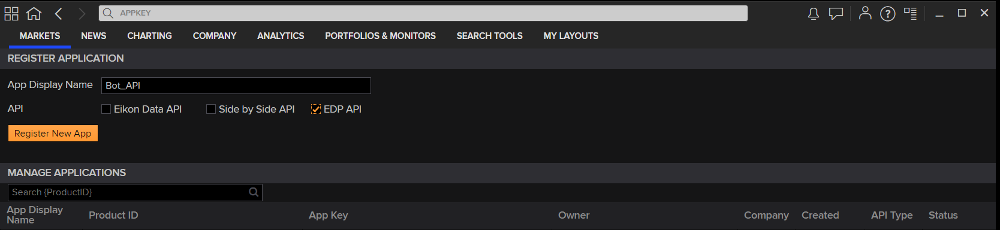
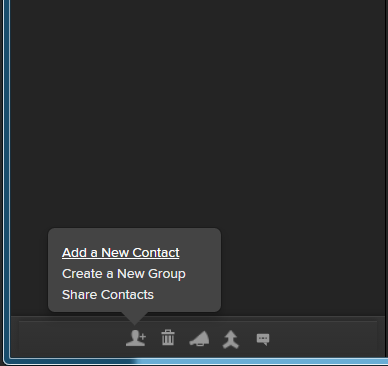
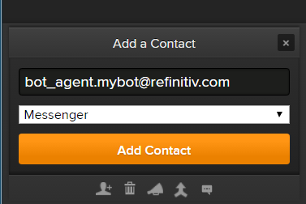
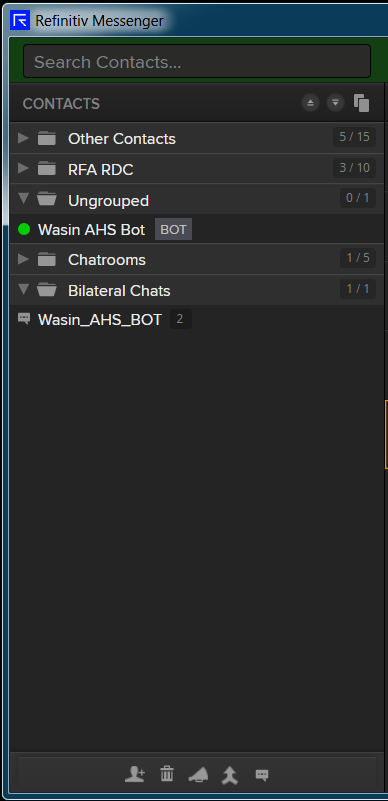
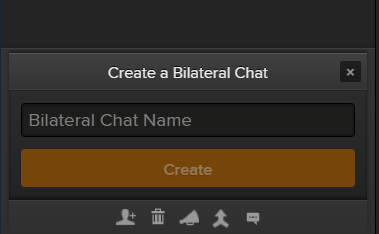
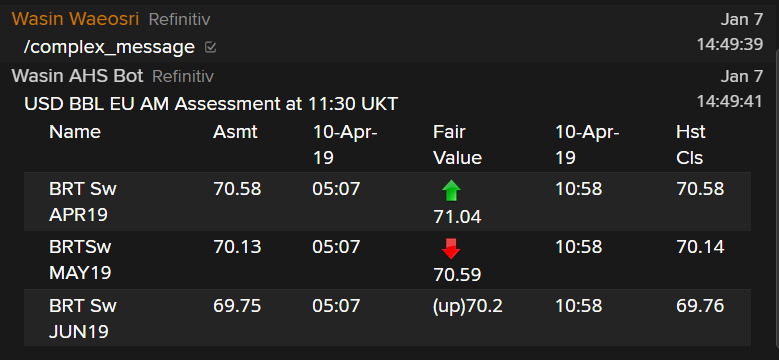

# Messenger Bot API Demo Applications with Python
- version: 1.5.0
- Last update: Oct 2023
- Environment: Windows
- Compiler: Python
- Prerequisite: [Access to Messenger application](#prerequisite)

Example Code Disclaimer:
ALL EXAMPLE CODE IS PROVIDED ON AN “AS IS” AND “AS AVAILABLE” BASIS FOR ILLUSTRATIVE PURPOSES ONLY. REFINITIV MAKES NO REPRESENTATIONS OR WARRANTIES OF ANY KIND, EXPRESS OR IMPLIED, AS TO THE OPERATION OF THE EXAMPLE CODE, OR THE INFORMATION, CONTENT, OR MATERIALS USED IN CONNECTION WITH THE EXAMPLE CODE. YOU EXPRESSLY AGREE THAT YOUR USE OF THE EXAMPLE CODE IS AT YOUR SOLE RISK.

## Messenger Bot API Introduction

Refinitiv's [Messenger application](https://www.refinitiv.com/en/products/refinitiv-messenger/) is a free to use, compliant and secure messaging platform.  It is a powerful communication tool that provides desktop, mobile, and web access, and allows sharing messages, data, files, screenshots, and emoticons with your contacts.

The [Messenger Bot API](https://developers.refinitiv.com/en/api-catalog/messenger-api/messenger-bot-api) provides a set of available API calls to build automated workflows or bots for the Messenger application. The Bot API allows your applications to connect with and pass information into Eikon’s Messenger service programmatically or interact with a bot via a WebSocket connection.

## Table of contents
* [Overview](#overview)
* [Prerequisite](#prerequisite)
* [Getting the AppKey value](#appkey)
* [Setting the Messenger application](#setting)
* [Running the REST API demo application](#running-rest)
* [Running the WebSocket API demo application](#running-ws)
* [Running demo applications with debug log](#running-debug)
* [Authors](#author)
* [References](#references)

## <a id="overview"></a>Messenger Bot API Demo overview

This demo project shows how to implement the basic Messenger BOT API console application workflows with the REST and WebSocket APIs in [Python](https://www.python.org/) programming language. The applications makes an authentication with [RDP](https://developers.refinitiv.com/en/api-catalog/refinitiv-data-platform/refinitiv-data-platform-apis) Auth service, then lets developers interact with Messenger Application/Chatroom on behalf of Bot via the REST and WebSocket APIs. 
- *chatbot_demo_rest.py*: A REST API example that sends chat message to individual and a Chatroom. 
- *chatbot_demo_ws.py*: A REST and WebSocket APIs example that sends and receives chat message with a Chatroom. 
- *rdp_token.py*: A Python module that manages RDP Authentication process for chatbot_demo_rest.py and chatbot_demo_ws.py applications. This module is based on [RDP Python Quickstart Python source code](https://developers.refinitiv.com/en/api-catalog/refinitiv-data-platform/refinitiv-data-platform-apis/downloads) implemented by Gurpreet Bal.
- *rdp_change_password_demo.py*: A Python script for changing RDP Account Password via RDP Auth Service API. This script is based on [RDP Python Quickstart Python source code](https://developers.refinitiv.com/en/api-catalog/refinitiv-data-platform/refinitiv-data-platform-apis/downloads) implemented by Gurpreet Bal.

Note: Please note that the main concept for using Messenger Bot REST and WebSocket APIs are the same for all technologies (see [JavaScript example](https://github.com/Refinitiv-API-Samples/Tutorial.MessengerChatBot.JavaScript)). 

**Caution**: 
The current RDP APIs' expires_time is 600 seconds (10 minutes - **As of June 2022**). However, the Messenger Bot WebSocket API still uses 300 seconds (5 minutes), so the example applications are hard-coded to use expires_time with the value 300. 

## <a id="prerequisite"></a>Prerequisite 
This tutorial source code requires the following dependencies.
1. [Messenger application](https://www.refinitiv.com/en/products/eikon-trading-software/eikon-messenger-securemessaging).
2. [Python](https://www.python.org/) compiler and runtime
3. Python's [requests 2.x](https://pypi.org/project/requests/) library for both REST and WebSocket connections.
4. Python's [websocket-client](https://pypi.org/project/websocket-client/) library (*version 0.49 or greater*) for the WebSocket connection .
4. Messenger Bot API access and license.

Please contact your Refinitiv's representative and Dino Diviacchi (dino.diviacchi@lseg.com) to help you to access Messenger application and Bot API. The Refinitiv team will then provision and set up the bot. Once this is done the email user you provided will receive an automated email with how to set up a password for the bot.

*Note:* 
- The Python example has been qualified with Python versions 3.9
- Please refer to the [pip installation guide page](https://pip.pypa.io/en/stable/installing/) if your environment does not have the [pip tool](https://pypi.org/project/pip/) installed. 

## <a id="appkey"></a>Getting the AppKey value

Once you have setup your Eikon Messenger user, please access the AppKey Generator Tool via Eikon Desktop/Refinitiv Workspace application (go to the Search Bar and type ```APP KEY```, then select the AppKey Generator). Please access with your Eikon account, *not your bot account*.

 

You can generate your AppKey via the following steps:
1. Enter an App Display Name
2. Select the tick box next to EDP API as the API Type
3. Click ‘Register’ New App button

You will then see a row for your new app with an AppKey item, which is your client_id for the Refinitiv Data Platform (RDP) Authentication. 

## <a id="setting"></a>Setting the Messenger application

Once you have setup your Messenger user and Bot user, you can add the Bot and create a Chatroom for you and your Bot via the following steps

1. Login to your personal Messenger to add the bot to your contacts, using “Add a New Contact” from the menu in the lower left corner.

     

2. Add bot name **bot_agent.mybot@refinitiv.com**.

     

3. Once you have add the bot it will show up under your contacts (on the left side).

     

4. Create a chatroom using "Create a Bilateral chatroom" button from the menu in the lower left corner.

     

5. Add your Bot to a chatroom by dragging it into your newly created chatroom. 

     

## <a id="running-rest"></a>Running the REST API demo application
1. Unzip or download the tutorial project folder into a directory of your choice 
2. Open a command prompt or console.
3. Run ```$>pip install -r rest-requirements.txt``` command in a console to install all the dependencies libraries.
4. Open the *chatbot_demo_rest.py* demo application source code with your editor and input the following parameters
    - ```app_key```: Your AppKey
    - ```bot_username```: Your Bot username
    - ```bot_password```: Your Bot password
    - ```recipient_email``` : Your associate Messenger email address 
    - ```chatroom_name``` : You chatroom name
5. OOpen a command prompt and go to folder *src*, then run the demo application with the following command.
    ```
    $>python chatbot_demo_rest.py
    ```
6. The application then authenticates with [RDP](https://developers.refinitiv.com/refinitiv-data-platform) Authentication service and sends a 1-1 message to your associate Eikon message email address. 
    ```
    Getting RDP Authentication Token

    Saving Authentication information to file
    Successfully Authenticated
    send 1 to 1 message to <email>
    Messenger BOT API: post a 1 to 1 message to <email> success
    ```
7. Then a demo gets an associate Chatroom and joining to that Chatroom.
    ```
    Get Rooms
    Messenger BOT API: get chatroom  success
    Join Rooms
    Messenger BOT API: join chatroom success
    ```
8. The demo application will send a default ```Hello from Python``` message to a Chatroom on behalf of the Bot API and lets you send your own message before leaving a Chatroom.
    ```
    sending message to {...} Rooms
    Messenger BOT API: post message to chatroom success
    Please input your message: Wendy, I'm home.
    Messenger BOT API: post message to chatroom success
    Leave Rooms
    Messenger BOT API: leave chatroom success
    ```

## <a id="running-ws"></a>Running the WebSocket API demo application
1. Unzip or download the tutorial project folder into a directory of your choice. 
2. Open a command prompt or console.
3. Run ```$>pip install -r ws-requirements.txt``` command in a console to install all the dependencies libraries.
4. Open the *chatbot_demo_ws.py* demo application source code with your editor and input the following parameters
    - ```app_key```: Your AppKey
    - ```bot_username```: Your Bot username
    - ```bot_password```: Your Bot password
    - ```recipient_email``` : Your associate Messenger email address (For 1 to 1 message)
    - ```chatroom_name``` : You chatroom name
5. Open a command prompt and go to folder *src*, then run the demo application with the following command.
    ```
    $>python chatbot_demo_ws.py
    ```
6. The demo will perform authentication process, get an associate chatroom, then join that chatroom as same as the REST API demo application [above](#running-rest)
7. Then demo connects to the Messenger BOT API WebSocket server. Once the application shows WebSocket ```connected``` event in a console, you can start interact with your bot via a chatroom.
    ```
    Messenger BOT API: join chatroom success
    Connecting to WebSocket wss://api.collab.refinitiv.com/services/nt/api/messenger/v1/stream ...
    WebSocket Connection is established
    Sent:....
    Received:
    {
    "event":"connected",
    "reqId":"943378"
    }
    ```
8. Now we should be able to receive a response from our chatbot. You can test by sending ```hello``` message in to a Chatroom to see an example.
9. The Messenger application supports tabular data, hyperlinks and a full set of emoji in the message. You can type ```/complex_message``` message into a Chatroom to see an example.
     

## Ping-Pong Message

Some network environments might have a policy/rule that needs some kind of heartbeat messages or activities every certain minutes to keep a WebSocket connection active. If you are encountering a WebSocket disconnection issue every 1 to 3 minutes, please try the following code statements in the main part of a ```chatbot_demo_ws.py``` file.

```
 # Connect to a Chatroom via a WebSocket connection
print('Connecting to WebSocket %s ... ' % (ws_url))
#websocket.enableTrace(True)
# web_socket_app = websocket.WebSocketApp(
#     ws_url,
#     on_message=on_message,
#     on_error=on_error,
#     on_close=on_close,
#     on_open=on_open,
#     subprotocols=['messenger-json'])
# # Event loop
# wst = threading.Thread(
#     target=web_socket_app.run_forever,
#     kwargs={'sslopt': {'check_hostname': False}})
    
## For the environment that needs a ping-pong message only
web_socket_app = websocket.WebSocketApp(ws_url,
    on_message=on_message,
    on_error=on_error,
    on_close=on_close,
    on_open=on_open,
    on_ping=on_ping,
    on_pong=on_pong,
    subprotocols=['messenger-json'])
# Event loop
wst = threading.Thread(target=web_socket_app.run_forever, kwargs={"sslopt": {"check_hostname": False}, "ping_interval": 60, "ping_timeout": 10, "ping_payload": "2"})
```

If the problem is persisting, please check your network firewall or proxy.

**Note**: Please note that all Messenger Bot API connections (HTTP and WebSocket) are going through the internet which is an uncontrolled environment, so there might be some network disconnection over a period of time. The example application aims for demonstrating the API workflow only. The code does not cover all use cases such as connection recovery (which can be various ways based on each developer's requirements). 

## <a id="author"></a>Authors
- Refinitiv Developer Advocate (https://developers.refinitiv.com/en)
- Dino Diviacchi (dino.diviacchi@lseg.com)

## <a id="references"></a>References
For further details, please check out the following resources:
* [Refinitiv Messenger Bot API page](https://developers.refinitiv.com/en/api-catalog/messenger-api/messenger-bot-api) on the [Refinitiv Developer Community](https://developers.refinitiv.com/) web site.
* [Refinitiv Messenger Bot API: Quick Start](https://developers.refinitiv.com/en/api-catalog/messenger-api/messenger-bot-api/messenger-bot-api/quick-start). 
* [Refinitiv Messenger Bot API: Documentation page](https://developers.refinitiv.com/en/api-catalog/messenger-api/messenger-bot-api/messenger-bot-api/docs).
* [Refinitiv Messenger Bot API Demo application - JavaScript](https://github.com/Refinitiv-API-Samples/Tutorial.MessengerChatBot.JavaScript)
* [Refinitiv Data Platform APIs page](https://developers.refinitiv.com/en/api-catalog/refinitiv-data-platform/refinitiv-data-platform-apis).

For any question related to the Messenger Bot API, please use the Developers Community [Q&A Forum](https://community.developers.refinitiv.com/spaces/303/index.html).